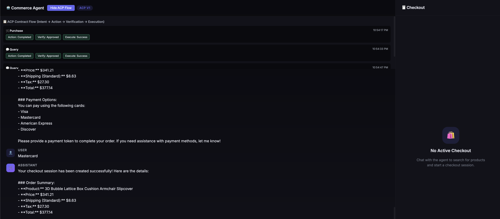
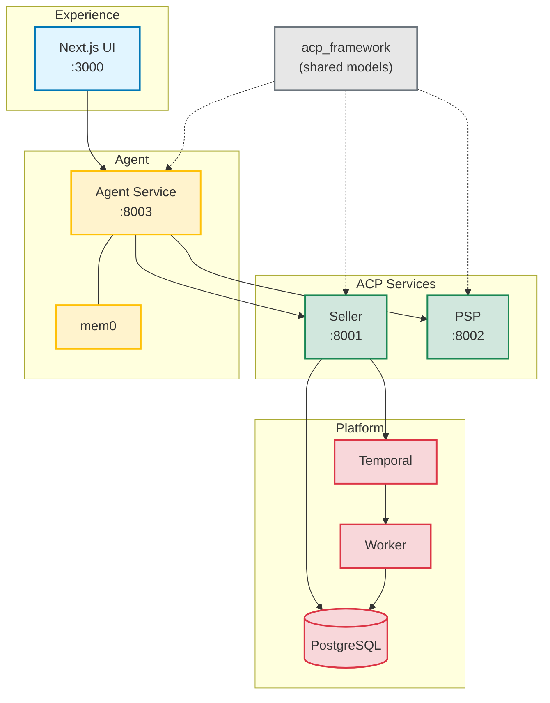
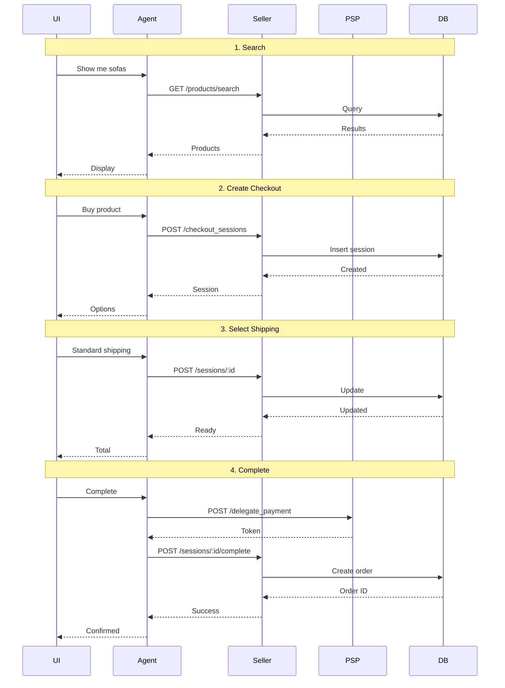
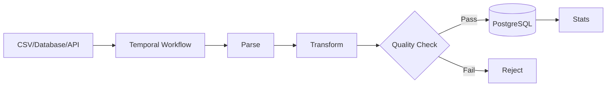

# ACP Infrastructure

Template and pattern for merchant/seller engineering teams to:

1. Integrate ACP into their commerce stack using proven service patterns
2. Deploy ACP-compatible seller and payment services
3. Connect those services to various agent experiences (including the demo agent/UI in this repo)

## Demo



The demo UI showcases a complete AI-powered shopping experience where users can search products, get recommendations, and complete purchases through natural conversation.

## What this system provides

- **`acp-framework` package** - Installable library for building ACP-compliant sellers and agents
- ACP Checkout API implementation (seller service)
- Delegate Payment API implementation (PSP service)
- Tool-using commerce agent (OpenAI Agents SDK)
- Durable catalog ingestion via Temporal workflows
- Shared ACP domain models and adapter abstractions

## Quick Install

```bash
# Install the framework
pip install git+https://github.com/shabazpatel/acp-infra.git

# Or clone and install locally
git clone https://github.com/shabazpatel/acp-infra.git
cd acp-infra
pip install -e .
```

Then use in your project:

```python
from acp_framework import ACPSellerAdapter, create_seller_router

class MyShopAdapter(ACPSellerAdapter):
    async def on_create_session(self, request):
        # Your checkout logic
        ...

app.include_router(create_seller_router(MyShopAdapter()))
```

## Architecture at a glance

### System Architecture



### Data Flow: Purchase Journey



### Ingestion Pipeline



## Request flow

1. User sends a message in UI.
2. Agent service resolves intent and calls seller/PSP tools.
3. Seller service creates/updates/completes ACP checkout sessions.
4. PSP service issues delegated payment tokens (mock or Stripe-backed).
5. Seller persists sessions/orders and action events for traceability.

## Local development

### Prerequisites

- Python 3.11+
- Node.js 18+
- Docker Desktop (for PostgreSQL + Temporal)
- `OPENAI_API_KEY`

### Bootstrap

```bash
git clone https://github.com/shabazpatel/acp-infra.git
cd acp-infra
chmod +x setup.sh
./setup.sh
```

`setup.sh` installs `uv`, creates `.venv`, installs dependencies, copies `.env`,
and starts Docker dependencies when available.

### Environment

```bash
cp .env.example .env
```

Minimum required variable:

- `OPENAI_API_KEY`

Optional integrations:

- `MEM0_API_KEY` (agent memory)
- `STRIPE_API_KEY` (real tokenization in PSP)
- `ACP_OPENAI_SIGNATURE_SECRET` (request signature verification)

### Run services

Use separate terminals.

```bash
# Terminal 1
source .venv/bin/activate
python -m services.pipeline.worker
```

```bash
# Terminal 2
source .venv/bin/activate
uvicorn services.seller.main:app --reload --port 8001
```

```bash
# Terminal 3
source .venv/bin/activate
uvicorn services.psp.main:app --reload --port 8002
```

```bash
# Terminal 4
source .venv/bin/activate
uvicorn services.agent.main:app --reload --port 8003
```

```bash
# Terminal 5
cd ui
npm install
npm run dev
```

Access UI at `http://localhost:3000`.

## Operational endpoints

### Health

- Seller: `GET /health` on `:8001`
- PSP: `GET /health` on `:8002`
- Agent: `GET /health` on `:8003`

### Seller service

- `GET /products/search`
- `GET /products/{product_id}`
- `GET /ratings/{product_id}`
- `POST /compare`
- ACP checkout router endpoints (mounted via `create_seller_router`)
- `POST /admin/ingest/product-csv`
- `POST /admin/ingest/source`
- `GET /admin/ingest/stats`

### PSP service

- `POST /agentic_commerce/delegate_payment`

Behavioral guarantees include API version validation, optional HMAC verification,
and idempotency replay semantics.

## Testing

Run unit/integration tests:

```bash
source .venv/bin/activate
pytest
```

Run ACP sandbox contract tests:

```bash
./test_acp_sandbox.sh
```

## Extending for a merchant integration

1. Implement an `ACPSellerAdapter` for your catalog, pricing, tax, fulfillment,
   and order backends.
2. Mount the adapter using `create_seller_router(...)`.
3. Replace demo search/product endpoints with your catalog APIs.
4. Wire webhook and audit sinks to your observability stack.
5. Enforce production auth and secret management per your platform standards.

## Deployment

- Generic deployment guidance: `DEPLOY.md`
- Railway-specific assets: `deployment/railway/`

For Railway, review and align:

- `railway.toml`
- `Procfile`
- `nixpacks.toml`
- `deployment/railway/README.md`

## Repository references

- **For Contributors**: [CONTRIBUTION_HELPER.md](CONTRIBUTION_HELPER.md) - Understand the codebase structure and find where to contribute
- **Architecture notes**: [docs/architecture.md](docs/architecture.md)
- **Docker topology**: [docker-compose.yml](docker-compose.yml)
- **Environment contract**: [.env.example](.env.example)

## Roadmap

We're actively developing ACP Infrastructure and welcome contributions! Here's what's planned:

### In Progress

- **Package Distribution**: Making `acp-framework` easily installable
  - ✅ Package structure with `pyproject.toml`
  - ✅ Installable via GitHub: `pip install git+https://github.com/shabazpatel/acp-infra.git`
  - 🔄 PyPI publishing for `pip install acp-framework`

- **Railway Deployment**: One-click deployment to Railway with automated service provisioning
  - Pre-configured `railway.toml` and `Procfile`
  - Environment variable templates
  - PostgreSQL and Redis provisioning

- **Temporal Cloud Integration**: Support for remote Temporal deployments
  - Connection configuration for Temporal Cloud
  - mTLS certificate management
  - Namespace and worker configuration

### Planned Features

- **Enhanced Agent Capabilities**
  - Multi-product comparison workflows
  - Order tracking and status updates
  - Return/refund flows via agent
  - Product recommendations based on purchase history

- **Production Readiness**
  - Rate limiting and circuit breakers
  - Enhanced observability (OpenTelemetry integration)
  - Security hardening (request signing, API key rotation)
  - Comprehensive load testing

- **Catalog Ingestion**
  - Additional source adapters (Shopify, BigCommerce, WooCommerce)
  - Real-time CDC via PostgreSQL logical replication
  - Delta ingestion for large catalogs
  - Schema validation and data quality monitoring

- **Agent Memory & Personalization**
  - Enhanced mem0 integration with user preferences
  - Shopping behavior analytics
  - Personalized product recommendations
  - Cross-session conversation continuity

- **Developer Experience**
  - Docker Compose one-command startup
  - Interactive setup wizard
  - Hot reload for all services
  - Local development dashboard

### Ideas & Future Exploration

- Multi-tenant seller support
- Marketplace aggregation (multi-seller checkout)
- Voice agent integration
- Mobile SDKs (iOS/Android)
- Analytics dashboard for sellers

Have ideas? [Open an issue](https://github.com/shabazpatel/acp-infra/issues) or check Contributing below!

## Contributing

We welcome contributions from the community! Whether you're fixing bugs, adding features, or improving documentation, your help is appreciated.

**👉 New to the codebase?** Start with [CONTRIBUTION_HELPER.md](CONTRIBUTION_HELPER.md) to understand how everything works and find good first issues.

### Getting Started

1. **Fork the repository** and clone your fork:
   ```bash
   git clone https://github.com/YOUR_USERNAME/acp-infra.git
   cd acp-infra
   ```

2. **Set up your development environment**:
   ```bash
   chmod +x setup.sh
   ./setup.sh
   ```

3. **Create a branch** for your work:
   ```bash
   git checkout -b feature/your-feature-name
   ```

4. **Make your changes** and test thoroughly:
   ```bash
   # Run tests
   source .venv/bin/activate
   pytest

   # Run ACP contract tests
   ./test_acp_sandbox.sh

   # Start all services and verify
   # (follow "Run services" section)
   ```

5. **Commit your changes**:
   ```bash
   git add .
   git commit -m "feat: add your feature description"
   ```

6. **Push and create a Pull Request**:
   ```bash
   git push origin feature/your-feature-name
   ```

### Contribution Guidelines

- **Code Style**: Follow existing patterns. We use `ruff` for Python linting.
- **Tests**: Add tests for new features. Maintain or improve test coverage.
- **Documentation**: Update relevant docs (README, docstrings, architecture notes).
- **Commit Messages**: Use conventional commit format (feat:, fix:, docs:, etc.).
- **ACP Compliance**: Ensure changes maintain ACP spec compatibility.

### Areas Where We Need Help

- **Documentation**: Tutorials, architecture diagrams, API reference
- **Testing**: Unit tests, integration tests, E2E scenarios
- **Deployment**: Guides for AWS, GCP, Azure, Kubernetes
- **Catalog Adapters**: Connectors for popular e-commerce platforms
- **UI/UX**: Improvements to the demo UI, mobile responsiveness
- **Performance**: Optimization, caching strategies, database tuning

### Questions?

- **Issues**: [github.com/shabazpatel/acp-infra/issues](https://github.com/shabazpatel/acp-infra/issues)
- **Discussions**: [github.com/shabazpatel/acp-infra/discussions](https://github.com/shabazpatel/acp-infra/discussions)

We review PRs regularly and provide feedback. Thanks for making ACP Infrastructure better!

## License

MIT (declared in `pyproject.toml`).
