# ACP Infrastructure

Template and pattern for merchant/seller engineering teams to:

1. Integrate ACP into their commerce stack using proven service patterns
2. Deploy ACP-compatible seller and payment services
3. Connect those services to various agent experiences (including the demo agent/UI in this repo)

## What this system provides

- ACP Checkout API implementation (seller service)
- Delegate Payment API implementation (PSP service)
- Tool-using commerce agent (OpenAI Agents SDK)
- Durable catalog ingestion via Temporal workflows
- Shared ACP domain models and adapter abstractions (`acp_framework/`)

## Architecture at a glance

### System Architecture


### Data Flow: End-to-End Purchase

```mermaid
sequenceDiagram
    participant U as Customer
    participant UI as UI (Next.js)
    participant A as Agent Service
    participant M as mem0
    participant S as Seller Service
    participant P as PSP Service
    participant DB as PostgreSQL

    %% 1. Product Search
    rect rgb(240, 248, 255)
        Note over U,DB: Phase 1: Product Discovery
        U->>UI: "Show me sofas under $500"
        UI->>A: POST /chat {message}
        A->>M: Search memories for user
        M-->>A: User preferences (optional)
        A->>S: GET /products/search?q=sofa&price_max=50000
        S->>DB: SELECT * FROM products WHERE...
        DB-->>S: [product rows]
        S-->>A: {products: [...], total_count: 156}
        A-->>UI: Product listing (5 items)
        UI-->>U: Display product cards
    end

    %% 2. Create Checkout
    rect rgb(240, 255, 240)
        Note over U,DB: Phase 2: Checkout Creation
        U->>UI: "Buy product 1549, ship to 123 Main St..."
        UI->>A: POST /chat {message}
        A->>M: Store customer info
        M-->>A: OK
        A->>S: POST /checkout_sessions<br/>{items: [{id: "1549", quantity: 1}],<br/>buyer: {...}, address: {...}}
        S->>DB: INSERT INTO checkout_sessions
        S->>DB: SELECT * FROM products WHERE id="1549"
        DB-->>S: Product details
        S->>DB: Calculate totals, tax
        DB-->>S: Session created
        S-->>A: {id: "cs_abc123", status: "not_ready_for_payment",<br/>line_items: [...], fulfillment_options: [...]}
        A-->>UI: "Checkout created! Choose shipping..."
        UI-->>U: Show fulfillment options
    end

    %% 3. Update Checkout
    rect rgb(255, 250, 240)
        Note over U,DB: Phase 3: Fulfillment Selection
        U->>UI: "Select standard shipping"
        UI->>A: POST /chat {message}
        A->>S: POST /checkout_sessions/cs_abc123<br/>{fulfillment_option_id: "ship_std"}
        S->>DB: UPDATE checkout_sessions<br/>SET fulfillment_option_id="ship_std"
        S->>DB: Recalculate totals with shipping
        DB-->>S: Updated session
        S-->>A: {id: "cs_abc123", status: "ready_for_payment",<br/>totals: [...]}
        A-->>UI: "Ready to complete! Total: $487.92"
        UI-->>U: Show order summary
    end

    %% 4. Payment Tokenization
    rect rgb(255, 240, 245)
        Note over U,DB: Phase 4: Payment Processing
        U->>UI: "Complete purchase"
        UI->>A: POST /chat {message}
        A->>P: POST /agentic_commerce/delegate_payment<br/>{payment_method: {...}, allowance: {...}}
        P-->>A: {id: "vt_mock_xyz", created: "2026-02-14T..."}
        Note over A: Token: vt_mock_xyz
    end

    %% 5. Complete Checkout
    rect rgb(248, 240, 255)
        Note over U,DB: Phase 5: Order Completion
        A->>S: POST /checkout_sessions/cs_abc123/complete<br/>{payment_data: {token: "vt_mock_xyz"}}
        S->>DB: BEGIN TRANSACTION
        S->>DB: INSERT INTO orders<br/>(id, checkout_session_id, total_cents)
        S->>DB: UPDATE checkout_sessions<br/>SET status="completed"
        S->>DB: INSERT INTO acp_action_events<br/>(intent, action, verification, execution)
        S->>DB: COMMIT
        DB-->>S: Order created
        S-->>A: {status: "completed",<br/>order: {id: "order_def456", permalink_url: "..."}}
        A->>M: Store purchase history
        M-->>A: OK
        A-->>UI: " Order confirmed! Order ID: order_def456"
        UI-->>U: Show order confirmation
    end

    %% 6. Audit Trail
    rect rgb(245, 245, 245)
        Note over DB: Phase 6: Audit & Observability
        DB->>DB: acp_action_events table stores:<br/>• Intent (PURCHASE)<br/>• Action (complete_checkout)<br/>• Verification (approved: true)<br/>• Execution (status: succeeded)
    end
```



### Ingestion Pipeline Flow

```mermaid
flowchart LR
    %% Data sources
    subgraph SOURCES[" Data Sources"]
        direction TB
        CSV["CSV Files<br/>(WANDS Dataset)"]
        POSTGRES["Postgres CDC<br/>(Future)"]
        API["REST API<br/>(Future)"]
    end

    %% Temporal workflows
    subgraph TEMPORAL_SYS["⏱️ Temporal Orchestration"]
        direction TB
        WF1["Workflow:<br/>IngestWANDSWorkflow"]
        WF2["Workflow:<br/>IngestCatalogSourceWorkflow"]
        ACT1["Activity:<br/>parse_wands_csv()"]
        ACT2["Activity:<br/>transform_and_load_products()"]
        ACT3["Activity:<br/>ingest_catalog_source()"]

        WF1 --> ACT1
        ACT1 --> ACT2
        WF2 --> ACT3
    end

    %% Database
    DB[("PostgreSQL<br/><br/>Tables:<br/>• products<br/>• ingestion_runs")]

    %% Quality gates
    QC["Quality Checks<br/><br/>• Min valid ratio: 90%<br/>• Max skipped: 5000<br/>• Required fields present<br/>• Price validation"]

    %% Trigger
    TRIGGER["Trigger<br/><br/>POST /admin/ingest/product-csv<br/>OR<br/>POST /admin/ingest/source"]

    %% Flow
    CSV --> ACT1
    POSTGRES -.->|"Future"| ACT3
    API -.->|"Future"| ACT3

    TRIGGER -->|"Start workflow"| WF1
    TRIGGER -->|"Start workflow"| WF2

    ACT2 --> QC
    ACT3 --> QC
    QC -->|"Valid: Bulk INSERT"| DB
    QC -->|"Invalid: Reject"| STATS["📊 Ingestion Stats<br/><br/>• total_rows<br/>• valid_rows<br/>• skipped_rows<br/>• status"]
    DB --> STATS

    STATS -->|"GET /admin/ingest/stats"| MONITOR["📈 Monitoring<br/><br/>Check ingestion success"]

    %% Styling
    classDef source fill:#e1f5ff,stroke:#0077b6,stroke-width:2px
    classDef temporal fill:#fff3cd,stroke:#ffc107,stroke-width:2px
    classDef database fill:#d1e7dd,stroke:#198754,stroke-width:2px
    classDef quality fill:#f8d7da,stroke:#dc3545,stroke-width:2px

    class CSV,POSTGRES,API source
    class WF1,WF2,ACT1,ACT2,ACT3 temporal
    class DB database
    class QC,STATS,MONITOR quality
```



## Request flow

1. User sends a message in UI.
2. Agent service resolves intent and calls seller/PSP tools.
3. Seller service creates/updates/completes ACP checkout sessions.
4. PSP service issues delegated payment tokens (mock or Stripe-backed).
5. Seller persists sessions/orders and action events for traceability.

## Local development

### Prerequisites

- Python 3.11+
- Node.js 18+
- Docker Desktop (for PostgreSQL + Temporal)
- `OPENAI_API_KEY`

### Bootstrap

```bash
git clone https://github.com/shabazpatel/acp-infra.git
cd acp-infra
chmod +x setup.sh
./setup.sh
```

`setup.sh` installs `uv`, creates `.venv`, installs dependencies, copies `.env`,
and starts Docker dependencies when available.

### Environment

```bash
cp .env.example .env
```

Minimum required variable:

- `OPENAI_API_KEY`

Optional integrations:

- `MEM0_API_KEY` (agent memory)
- `STRIPE_API_KEY` (real tokenization in PSP)
- `ACP_OPENAI_SIGNATURE_SECRET` (request signature verification)

### Run services

Use separate terminals.

```bash
# Terminal 1
source .venv/bin/activate
python -m services.pipeline.worker
```

```bash
# Terminal 2
source .venv/bin/activate
uvicorn services.seller.main:app --reload --port 8001
```

```bash
# Terminal 3
source .venv/bin/activate
uvicorn services.psp.main:app --reload --port 8002
```

```bash
# Terminal 4
source .venv/bin/activate
uvicorn services.agent.main:app --reload --port 8003
```

```bash
# Terminal 5
cd ui
npm install
npm run dev
```

Access UI at `http://localhost:3000`.

## Operational endpoints

### Health

- Seller: `GET /health` on `:8001`
- PSP: `GET /health` on `:8002`
- Agent: `GET /health` on `:8003`

### Seller service

- `GET /products/search`
- `GET /products/{product_id}`
- `GET /ratings/{product_id}`
- `POST /compare`
- ACP checkout router endpoints (mounted via `create_seller_router`)
- `POST /admin/ingest/product-csv`
- `POST /admin/ingest/source`
- `GET /admin/ingest/stats`

### PSP service

- `POST /agentic_commerce/delegate_payment`

Behavioral guarantees include API version validation, optional HMAC verification,
and idempotency replay semantics.

## Testing

Run unit/integration tests:

```bash
source .venv/bin/activate
pytest
```

Run ACP sandbox contract tests:

```bash
./test_acp_sandbox.sh
```

## Extending for a merchant integration

1. Implement an `ACPSellerAdapter` for your catalog, pricing, tax, fulfillment,
   and order backends.
2. Mount the adapter using `create_seller_router(...)`.
3. Replace demo search/product endpoints with your catalog APIs.
4. Wire webhook and audit sinks to your observability stack.
5. Enforce production auth and secret management per your platform standards.

## Deployment

- Generic deployment guidance: `DEPLOY.md`
- Railway-specific assets: `deployment/railway/`

For Railway, review and align:

- `railway.toml`
- `Procfile`
- `nixpacks.toml`
- `deployment/railway/README.md`

## Repository references

- Architecture notes: `docs/architecture.md`
- Docker topology: `docker-compose.yml`
- Environment contract: `.env.example`

## License

MIT (declared in `pyproject.toml`).
